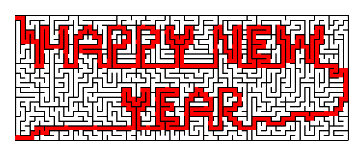

# messagemaze - A Python package for generating custom message mazes



## Acknowledgement

We would like to thank [Prof. Muriel Visani](https://pageperso.univ-lr.fr/mvisani/) for her guidance and support throughout the project. She encouraged us all to choose original problems to work on and rejected any ideas that were too simple or had already been solved. If it weren't for her, we might have ended up developing something like a Minesweeper game or a Sudoku solver.

We were intrigued by the concept of the message maze, and after some internet research, we found no open-source algorithms or implementations doing the same thing. The only implementation we found was [Mazebrite.com](https://www.mazebrite.com/). Since it was closed source, we had a fun time figuring out how to work out the implementation ourselves, using the site letter's font (solution path of each letter) and using the output from the site as our inspiration and objective. Thus we kindly thank Dr. David Grossman for his work on Mazebrite.com.

We also kindly request that any other users who utilize our implementation include an acknowledgment of the pioneering work of Dr. David Grossman and Mazebrite.com in their documentation or project descriptions.


## Introduction

`messagemaze` is a Python package for generating message mazes - a type of maze where a solution path spells out a message. With this package, you can easily create and customize your maze game with unique messages.

The package contains various modules to generate and visualize generating process. You can use built-in algorithms or create your own to generate mazes, and use the drawing tool to customize the solution path.

To get started, simply install the package using pip and follow the instruction below. The package also includes an ipython notebook with basic usage examples to help you get started.

We hope you enjoy using `messagemaze` and look forward to seeing the creative message mazes you come up with!

## Contributors

This work was done as part of the course `Introduction to Artificial Intelligence - IT3160E` at Hanoi University of Science and Technology. Team members include:

- [Nguyễn Lân Cường](https://github.com/cuonglannguyen)
- [Phạm Tiến Sơn](https://github.com/phamson02)
- [Phạm Vũ Huyền Trang](https://github.com/PhamVuHuyenTrang)
- [Đào Văn Tùng](https://github.com/tungbinhthuong)
- [Bùi Thanh Tùng](https://github.com/TungTBui)

## Installation

All the modules are included in a package called 'messagemaze' which can be installed using pip.
It is recommended to first create a virtual environment by running the following command in
the directory of the project:

Linux/MacOs/Windows:

```
$ python3 -m venv venv
```

Then activate the virtual environment by running the following command:

Linux/MacOs:

```
$ source venv/bin/activate
```

Windows:

```
$ .\venv\Scripts\activate.bat
```

Then install the modules using the following command:

```
$ pip install -e .
```

It will automatically install all dependent libraries required (there is one in this project which is the `pygame`). The dot `.` indicates that the command is run from the directory of the project.

## Usage

After the module was successfully installed, you can try open the ipython notebook [runner.ipynb](runner.ipynb) which introduces basic usage of the package (make sure to open it in the environment you previously installed the package in).

## List of Modules

- [cell.py](src/messagemaze/cell.py): contains the class Cell with methods to add walls and remove walls
- [maze.py](src/messagemaze/maze.py): contains the class Maze with methods to generate a maze and to display it
- [message_path.py](src/messagemaze/message_path.py): contains the class MessagePath with methods to generate a message path
- [random_path.py](src/messagemaze/random_path.py): contains the function RandomPattern to generate a random path connecting two points in a rectangular grid
- [draw_pattern.py](src/messagemaze/draw_pattern.py): contains the function DrawPattern which allows users to draw a pattern - the desired solution path of a maze on a rectangular grid
- [combine.py](src/messagemaze/combine.py): contains 2 functions to combine a list of Maze objects to create another Maze object,
  horizontally and vertically
- [maze_viz.py](src/messagemaze/maze_viz.py): contains the class Visualizer contains methods to save the maze as
  a picture and to display the maze in a window
- [algorithms.py](src/messagemaze/algorithms.py): contains 3 algorithms to generate the maze given a rectangular grid - a blank Maze objectcor a Maze object with only solution path generated from MessagePath
- [visualize_algorithms.py](src/messagemaze/visualize_algorithms.py): contains 3 algorithms as above but were modified for visualization purpose
